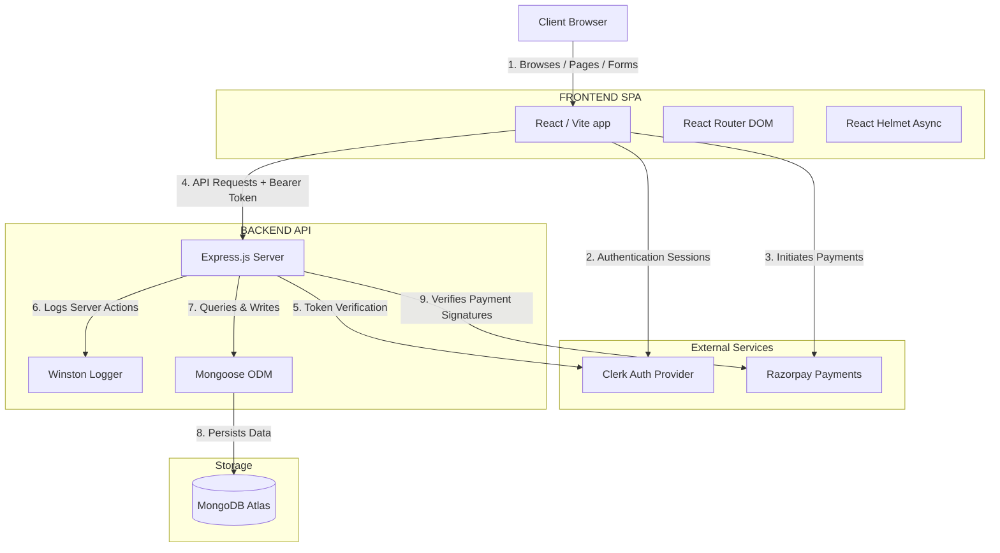

# FilingBy - Client Portal & Virtual Office Ecosystem

Welcome to the central repository for **FilingBy.com**, a modern, high-performance web application designed for Chartered Accountant (CA) filing services and virtual office solutions. 

The FilingBy platform is split into a **Frontend (React + Vite)** SPA and a **Backend (Express + Node.js)** REST API with MongoDB database management. This README details the ecosystem architecture, module structures, setup guidelines, and references for developers.

---

## 🗺️ System Architecture

Below is a high-level visual representation of how the FilingBy frontend, backend, and external services interact:



---

## 📁 Repository Structure

```
filingbycom/
├── BACKEND/                    # Node.js + Express.js API server
│   ├── src/                    # App source code (controllers, routes, models, middleware)
│   ├── scripts/                # Data seeding & migration scripts
│   ├── index.js                # Server entry point
│   └── ARCHITECTURE.md         # Detailed Backend Architectural Guidelines
│
├── FRONTEND/                   # React + Vite Single Page Application
│   ├── src/                    # Frontend source code (features, components, routes, shared)
│   ├── public/                 # Static assets (images, logos, etc.)
│   ├── vercel.json             # Edge redirects & CDN configs
│   ├── ARCHITECTURE.md         # Detailed Frontend Architectural Guidelines
│   └── README.md               # Frontend setup documentation
│
└── handover_testing_guide.txt  # Comprehensive Client Handover & QA Testing Guide
```

---

## ⚡ Main Feature Domains

1. **CA Portal (Standard Client Workspace)**
   * **Public Service Fold**: Digital catalog of CA services with custom pricing slabs and dynamic checklists (GST Registration, ITR Filing, Trust Audits).
   * **Checkout Flow**: Fully integrated Razorpay checkout system for instant invoicing and client transaction capture.
   * **Client Dashboard (`/dashboard`)**: Secure workspace where users view order statuses, upload compliance documents, and inspect payment receipts.

2. **Virtual Space (Virtual Office Domain)**
   * **Locations Directory**: Dynamic, interactive search maps and state/city filter lists.
   * **Quote Wizard**: Real-time multi-step interactive pricing calculator with lead generation.
   * **Partner Program**: Standard desk/landlord onboarding applications.
   * **Tenant Dashboard (`/virtual-office/dashboard`)**: Independent dashboard for corporate address tenants to view compliance notices, inspect scanned mailbox items, and check scheduled tax audit inspections.

3. **Admin Control Room (`/admin` & `/admin/dashboard`)**
   * Secure, central hub where administrators manage service catalogs, review submitted leads, verify payment details, update compliance statuses, and manage virtual workspace directories.

4. **SEO & Legacy Shopify Redirect System**
   * Complete mapping of older Shopify URLs (e.g. `/pages/*`, `/products/*`) redirects directly to the corresponding React SPA routes to maintain domain authority and SEO rankings. Managed via [vercel.json](file:///d:/WEBSITE%20DEVELOPMENT/filingbycom/FRONTEND/vercel.json).

---

## 🚀 Getting Started & Local Setup

### Prerequisites
* **Node.js** (v18+ recommended)
* **MongoDB** (Local instance or MongoDB Atlas Connection URI)
* **Clerk Developer Account** (For secure client-side user sessions and token validation)
* **Razorpay Developer Keys** (For processing testing payments)

---

### Backend Setup

1. Open a terminal and navigate to the `BACKEND` directory.
2. Install dependencies:
   ```bash
   npm install
   ```
3. Create a `.env` file in the [BACKEND](file:///d:/WEBSITE%20DEVELOPMENT/filingbycom/BACKEND) directory and specify the following variables:
   ```env
   PORT=3000
   MONGODB_URI=mongodb://localhost:27017/filingby
   CLERK_PUBLISHABLE_KEY=your_clerk_publishable_key
   CLERK_SECRET_KEY=your_clerk_secret_key
   RAZORPAY_KEY_ID=your_razorpay_key_id
   RAZORPAY_KEY_SECRET=your_razorpay_key_secret
   WHATSAPP_TOKEN=your_whatsapp_api_token
   WHATSAPP_PHONE_NUMBER_ID=your_whatsapp_phone_number_id
   ```
4. Start the backend developer server with hot reload:
   ```bash
   npm run dev
   ```
   *(Production deployment starts using `npm start`)*

---

### Frontend Setup

1. Open a terminal and navigate to the `FRONTEND` directory.
2. Install dependencies:
   ```bash
   npm install
   ```
3. Create a `.env` file in the [FRONTEND](file:///d:/WEBSITE%20DEVELOPMENT/filingbycom/FRONTEND) directory:
   ```env
   VITE_CLERK_PUBLISHABLE_KEY=your_clerk_publishable_key
   VITE_BACKEND_URL=http://localhost:3000
   ```
4. Start the frontend local Vite server:
   ```bash
   npm run dev
   ```
5. Open `http://localhost:5173` to view the application in your browser.

---

## 🛠️ Development Scripts

| Directory | Script | Command | Purpose |
| :--- | :--- | :--- | :--- |
| **BACKEND** | Dev Server | `npm run dev` | Runs Express API using `nodemon` |
| **BACKEND** | Production | `npm start` | Launches Node.js server with memory boundaries |
| **FRONTEND** | Dev Server | `npm run dev` | Runs the Vite preview client |
| **FRONTEND** | Build | `npm run build` | Builds production artifacts to `/dist` |
| **FRONTEND** | Lint | `npm run lint` | Inspects code for syntax and style violations |

---

## 📖 Essential Developer Documents

Please refer to the following local developer documents for detailed guidelines:
* **Frontend Guidelines**: Read the [FRONTEND/ARCHITECTURE.md](file:///d:/WEBSITE%20DEVELOPMENT/filingbycom/FRONTEND/ARCHITECTURE.md) to learn about our barrel exports policies, local vs global state rules, anti-request-storm context caching logic, and SEO Helmet injections.
* **Backend Guidelines**: Read the [BACKEND/ARCHITECTURE.md](file:///d:/WEBSITE%20DEVELOPMENT/filingbycom/BACKEND/ARCHITECTURE.md) for REST API conventions, Mongoose indexing rules, payload validations, error envelopes, and PM2 deployment.
* **Testing & Handover Guide**: Refer to [handover_testing_guide.txt](file:///d:/WEBSITE%20DEVELOPMENT/filingbycom/handover_testing_guide.txt) for credentials, testing flows, and legacy redirect verification targets.
